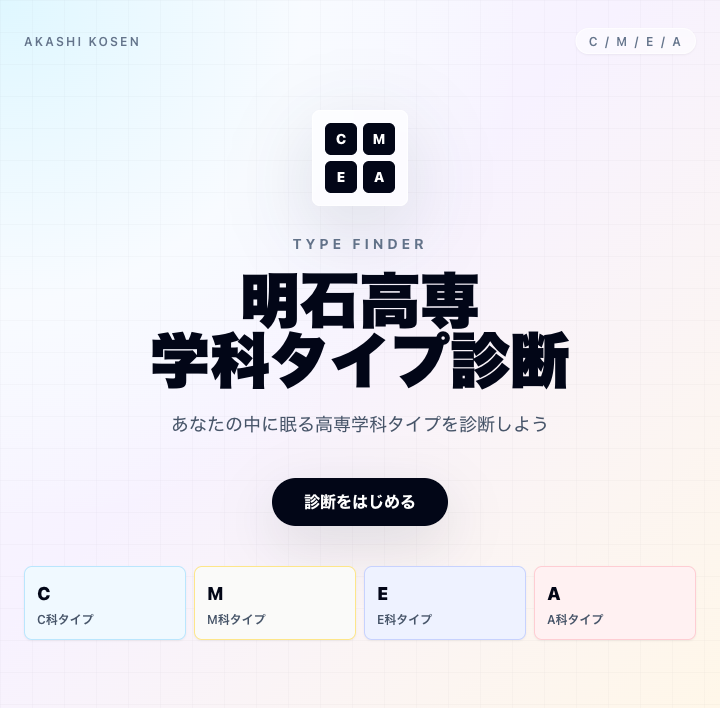
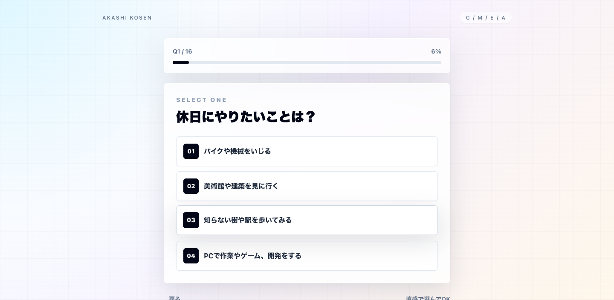
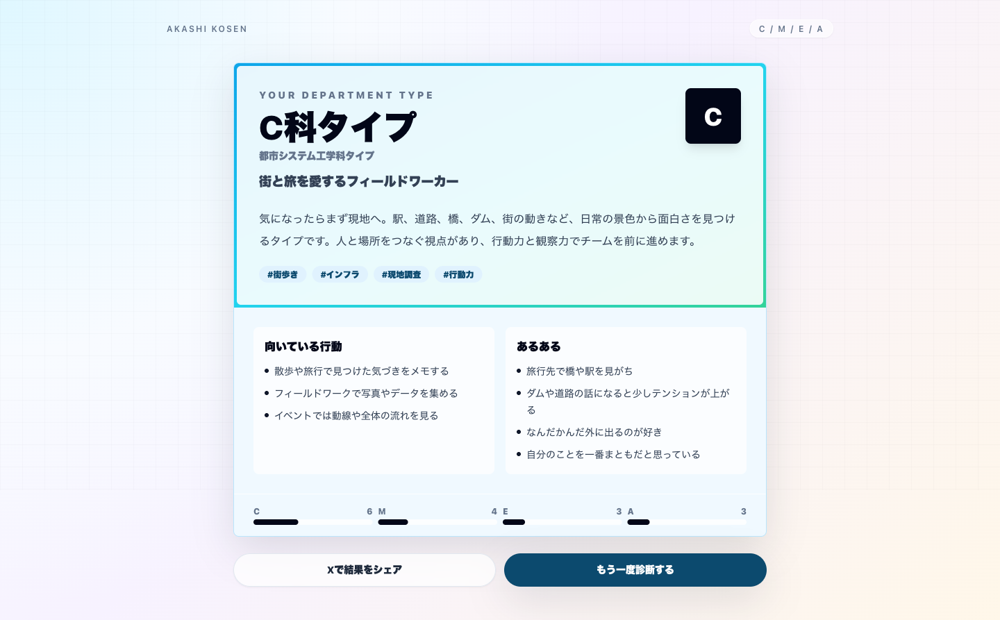

# 明石高専 学科タイプ診断

明石高専の C科 / M科 / E科 / A科 の雰囲気を、MBTI風に楽しく診断するReactアプリです。

## スクリーンショット

### トップ画面


### 質問画面


### 結果画面


## 起動

```bash
npm install
npm run dev
```

ブラウザで表示されたローカルURLを開くと診断できます。

## ビルド

```bash
npm run build
```

## デプロイ

Cloudflare Workers Static Assets / Cloudflare Pages への公開手順は `DEPLOYMENT.md` にまとめています。

## 編集する場所

- 質問: `src/data/diagnosis.ts` の `questions`
- 結果カード: `src/data/diagnosis.ts` の `results`
- 画面UIと診断ロジック: `src/App.tsx`

診断は選択肢ごとに C / M / E / A へ1点ずつ加算し、同点の場合は直近の回答傾向を反映します。
